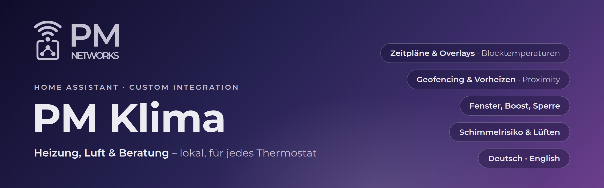

  

  
  
  
  
  
  

  

# PM Klima

**Eine komplette Heizungssteuerung für Home Assistant – lokal, ohne Cloud und für jedes
Thermostat.** Zeitpläne mit Blocktemperaturen, manuelle Overlays, Abwesenheit und Vorheizen per
Geofencing, Fenstererkennung, Boost und Sommerbetrieb. Dazu ein Luftmodul mit Schimmelrisiko und
Lüftempfehlung sowie eine Beratung, die sich zurückhaltend per Push, Sprachansage oder Wanddisplay
meldet.

## Warum PM Klima?

| | |
|---|---|
| **Ein Raum, ein Thermostat-Objekt** | `climate.pm_<raum>` mit Modi *auto / heat / off* und Presets *zeitplan, manuell, komfort, eco, abwesend, frostschutz, boost*. |
| **Zeitpläne wie in der Hersteller-App** | Helfer *Zeitplan* mit eigener Temperatur je Block; manuelle Änderungen gelten bis zum nächsten Wechsel, für X Minuten oder dauerhaft. |
| **Geofencing & Vorheizen** | Absenkung, wenn niemand zuhause ist; Vorheizen in Stufen, wenn sich jemand nähert (Proximity). |
| **Fenster, Boost, Sommer** | Frostschutz bei offenem Fenster, Boost auf Knopfdruck, Sperre ab Außentemperatur oder per Sommerschalter. |
| **Erklärt sich selbst** | Attribut `anzeige` im Klartext: „Zeitplan · 21,5 °C bis 23:00“, „Fenster offen · Frostschutz (danach 21 °C)“. |
| **Luft** | Absolute Feuchte, Taupunkt, Schimmelrisiko an der kältesten Wandstelle, Lüftempfehlung und -dauer, Luftreiniger-Automatik. |
| **Beratung** | Gedrosselte Empfehlungen mit Ruhezeit und Stummschaltern; zehn Textvarianten je Thema, Deutsch und Englisch. |
| **Jedes Thermostat** | Zigbee, Homematic, FRITZ!DECT, Netatmo, HomeKit, Matter, tado, `generic_thermostat` – PM Klima nutzt nur Standarddienste. |
| **Lokal** | Keine Cloud, keine Abhängigkeiten. Umstieg von einer Cloud-Anbindung (z. B. tado) ohne Neueinrichtung. |

## Schnellstart

1. **Installieren** – am einfachsten über den Button *Open in HACS* oben: *PM Klima*
   herunterladen → Home Assistant neu starten. Alternativ HACS → ⋮ → Benutzerdefinierte
   Repositories → `https://github.com/D0GC/HA-PM-Networks-Klima` (Integration).
   ([Details](docs/installation.md))
2. **Zentrale einrichten** – Einstellungen → Geräte & Dienste → Integration hinzufügen →
   *PM Klima*: Personen, Abwesenheit, Sperre, Luft, Beratung. ([Details](docs/einrichtung.md#teil-1-zentrale))
3. **Räume anlegen** – *Raum hinzufügen*: Thermostat(e), Sensoren, Fenster, Zeitplan,
   Temperaturen. ([Details](docs/einrichtung.md#teil-2-räume))
4. **Hersteller-Logik abschalten** – Zeitpläne und Geofencing in der Hersteller-App aus.
5. **Dashboard** – [Beispiel](docs/dashboard.md) übernehmen und mit einem Raum beginnen.

<table>
  <tr>
    <td width="50%"> Zentrale und Räume als Untereinträge</td>
    <td width="50%"> Raumthermostat mit Presets</td>
  </tr>
  <tr>
    <td> Raum einrichten – Geräte</td>
    <td> Abwesenheit & Vorheizen</td>
  </tr>
</table>

## Dokumentation

| Seite | Inhalt |
|---|---|
| [Installation](docs/installation.md) | HACS, manuell, Update, Deinstallation |
| [Einrichtung](docs/einrichtung.md) | Zentrale und Räume Schritt für Schritt – mit Screenshots jedes Dialogs |
| [Funktionsweise](docs/funktionsweise.md) | Prioritäten, Overlays, Presets, Abwesenheitsphasen, externes „aus“, Grenzen |
| [Thermostate & Anbindung](docs/thermostate.md) | Welche Geräte, wie sie angesprochen werden, Thermostat wechseln |
| [Umstieg tado → lokal](docs/umstieg-tado-lokal.md) | tado ohne Web-API über HomeKit oder Matter |
| [Luft & Beratung](docs/luft-und-beratung.md) | Formeln, Lüftempfehlung, Luftreiniger, Kanäle und Regeln der Beratung |
| [Entitäten & Dienste](docs/entitaeten-und-dienste.md) | Alle Entitäten und Attribute, Dienste, Automationsbeispiele |
| [Dashboard](docs/dashboard.md) | Beispiel-Dashboard mit Standardkarten |
| [FAQ & Fehlersuche](docs/faq.md) | Häufige Fragen und Lösungen |
| [Changelog](CHANGELOG.md) · [Mitwirken](CONTRIBUTING.md) | Versionen, Entwicklung, Tests |

## In English

PM Klima is a complete, **local** heating controller for Home Assistant that works with **any
thermostat** exposed as a `climate` entity: schedules with per-block temperatures, manual
overlays, away/preheat via proximity, window detection, boost and a summer lock – plus an air
module (absolute humidity, dew point, mould risk, ventilation advice, purifier automation) and an
advice module (push, voice announcements, wall display). The user interface is available in
German and English; runtime texts (display text, recommendations, messages) follow the option
*Language of generated texts* (automatic = Home Assistant language).

Install via HACS as a custom repository (category *Integration*), restart Home Assistant and add
*PM Klima* under Settings → Devices & services. The detailed documentation is written in German;
the screenshots and YAML examples are language-independent.

---

PM Klima ist ein Projekt von PM Networks und steht in keiner Verbindung zu tado GmbH oder zu
anderen Herstellern. Alle Screenshots stammen aus einer Demo-Instanz mit Beispieldaten.
