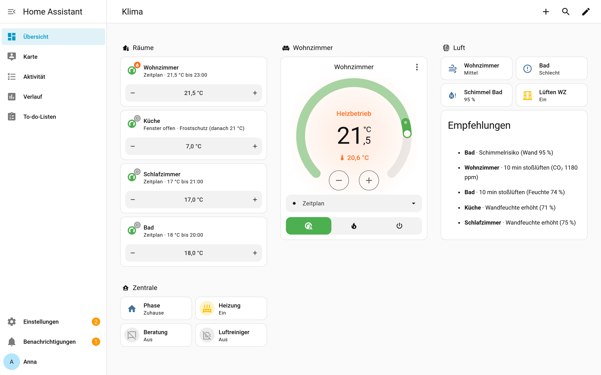
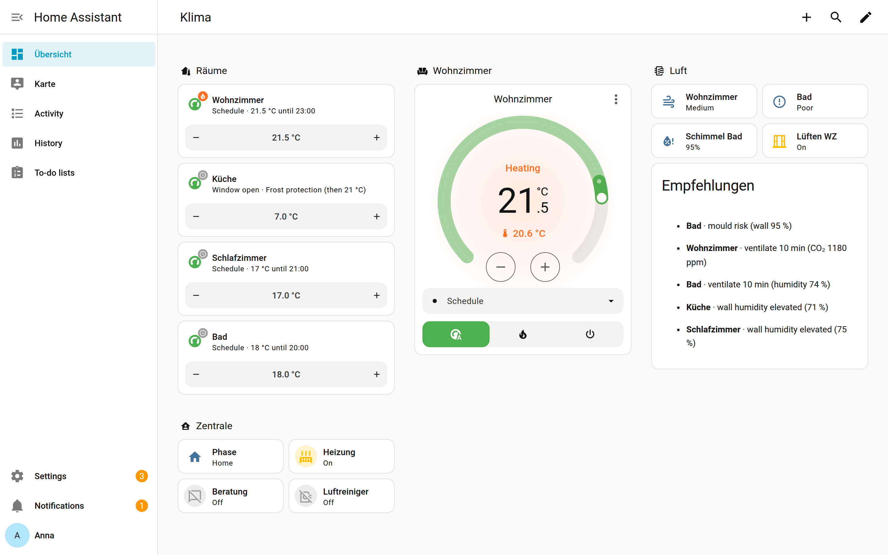

# Dashboard

[← Zurück zur Übersicht](../README.md)



Das Beispiel nutzt ausschließlich Standardkarten von Home Assistant (Sections-Ansicht) – keine
Zusatzkarten aus HACS nötig. Die komplette Konfiguration liegt in
[`docs/beispiele/dashboard.yaml`](beispiele/dashboard.yaml).

**Übernehmen:** Dashboard öffnen → ✏️ Bearbeiten → ⋮ → **Raw-Konfigurationseditor** → Inhalt
einfügen → Raumnamen bzw. Entitäts-IDs anpassen → Speichern.

## Die Bausteine

**Raum-Kachel mit Klartext-Anzeige** – `state_content: anzeige` zeigt, *warum* gerade welche
Temperatur gilt („Zeitplan · 21,5 °C bis 23:00“, „Fenster offen · Frostschutz (danach 21 °C)“):

```yaml
type: tile
entity: climate.pm_wohnzimmer
name: Wohnzimmer
state_content: anzeige
grid_options:
  columns: 12
features_position: bottom
features:
  - type: target-temperature
```

**Thermostat mit Presets und Modi** – `zeitplan`, `manuell`, `komfort`, `eco`, `abwesend`,
`frostschutz`, `boost`:

```yaml
type: thermostat
entity: climate.pm_wohnzimmer
features:
  - type: climate-preset-modes
    style: dropdown
  - type: climate-hvac-modes
    hvac_modes: [auto, heat, "off"]
```

**Empfehlungsliste** aus dem Modul Beratung:

```yaml
type: markdown
title: Empfehlungen
content: |-
  
  
  - **{{ e.raum }}** · {{ e.text.split(': ', 1)[1] if ': ' in e.text else e.text }}
  
  Keine Empfehlung.
  
```

## Englisch

Mit der Option *Sprache der Texte* = Englisch (oder *Automatisch* bei englischem Home Assistant)
erscheinen Anzeige, Empfehlungen und Meldungen auf Englisch:


