# Einrichtung Schritt für Schritt

[← Zurück zur Übersicht](../README.md)

Die Einrichtung besteht aus zwei Teilen: der **Zentrale** (einmal je Installation) und den
**Räumen** (je Raum ein Untereintrag). Alles lässt sich später ändern: Zentrale über das Zahnrad
**Konfigurieren**, Räume über das Zahnrad **Raum bearbeiten**.

Inhalt: [Vorbereitung](#vorbereitung) · [Zentrale](#teil-1-zentrale) · [Räume](#teil-2-räume) ·
[Zeitplan](#teil-3-zeitplan-mit-blocktemperaturen) · [Hersteller-Logik abschalten](#teil-4-parallel-laufende-hersteller-logik-abschalten) ·
[Erster Test](#teil-5-erster-test)

---

## Vorbereitung

Diese Entitäten sollten vorhanden sein, bevor Sie beginnen:

| Wofür | Entität | Pflicht |
|---|---|---|
| Wer wohnt hier? | `person.*` | ja |
| Thermostat je Raum | `climate.*` | ja |
| Anwesenheit (entprellt) | `input_boolean.*` / `binary_sensor.*` | nein |
| Vorheizen bei Annäherung | Proximity: Abstands- und Richtungssensor je Person | nein |
| Sommerbetrieb | Außentemperatur-Sensor, optional Freigabe-Schalter | nein |
| Zeitplan je Raum | Helfer **Zeitplan** (`schedule.*`) | nein (sonst dauerhaft Komfort) |
| Fenster | `binary_sensor.*` (window/door/opening) | nein |
| Luftmodul | Feuchte-, CO₂-, PM2,5-Sensoren, Außenluftfeuchte, Wetter | nein |

---

## Teil 1: Zentrale

Einstellungen → Geräte & Dienste → Integration hinzufügen → **PM Klima**.

### Schritt 1 – Personen & Proximity

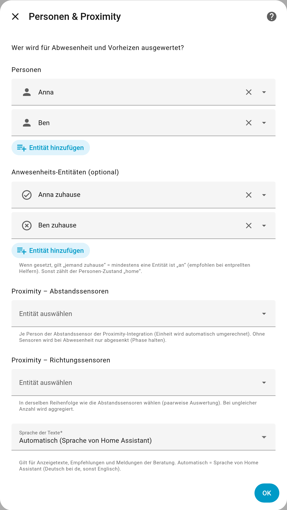

* **Personen** – alle Bewohner. Ohne Anwesenheits-Entitäten gilt der Personen-Zustand `home`.
* **Anwesenheits-Entitäten** – empfohlen, wenn Sie entprellte Helfer haben („jemand zuhause“ =
  mindestens eine ist *an*). Das verhindert Fehlabsenkungen durch kurze GPS-Aussetzer.
* **Proximity-Sensoren** – je Person Abstand und Richtung aus der Proximity-Integration.
  **Wichtig:** Richtungssensoren in derselben Reihenfolge wie die Abstandssensoren wählen.
  Ohne Proximity senkt PM Klima bei Abwesenheit nur ab (keine Vorheizstufen).
* **Sprache der Texte** – *Automatisch* folgt der Sprache von Home Assistant (Deutsch bei `de`,
  sonst Englisch). Betrifft Anzeige, Empfehlungen und Meldungen.

### Schritt 2 – Abwesenheit & Vorheizen

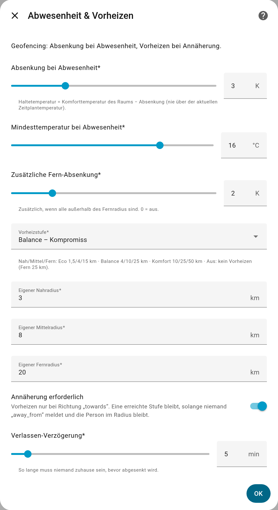

| Feld | Bedeutung | Standard |
|---|---|---|
| Absenkung | Haltetemperatur = Komfort des Raums − Absenkung | 3 K |
| Mindesttemperatur | Untergrenze bei Abwesenheit | 16 °C |
| Fern-Absenkung | zusätzlich, wenn alle weiter als der Fernradius entfernt sind | 2 K |
| Vorheizstufe | Radien Nah/Mittel/Fern (Eco 1,5/4/15 km · Balance 4/10/25 km · Komfort 10/25/50 km · eigene) | Balance |
| Annäherung erforderlich | Vorheizen nur bei Richtung „towards“ | an |
| Verlassen-Verzögerung | so lange muss niemand zuhause sein, bevor abgesenkt wird | 5 min |

### Schritt 3 – Sperre (Außentemperatur / Freigabe)

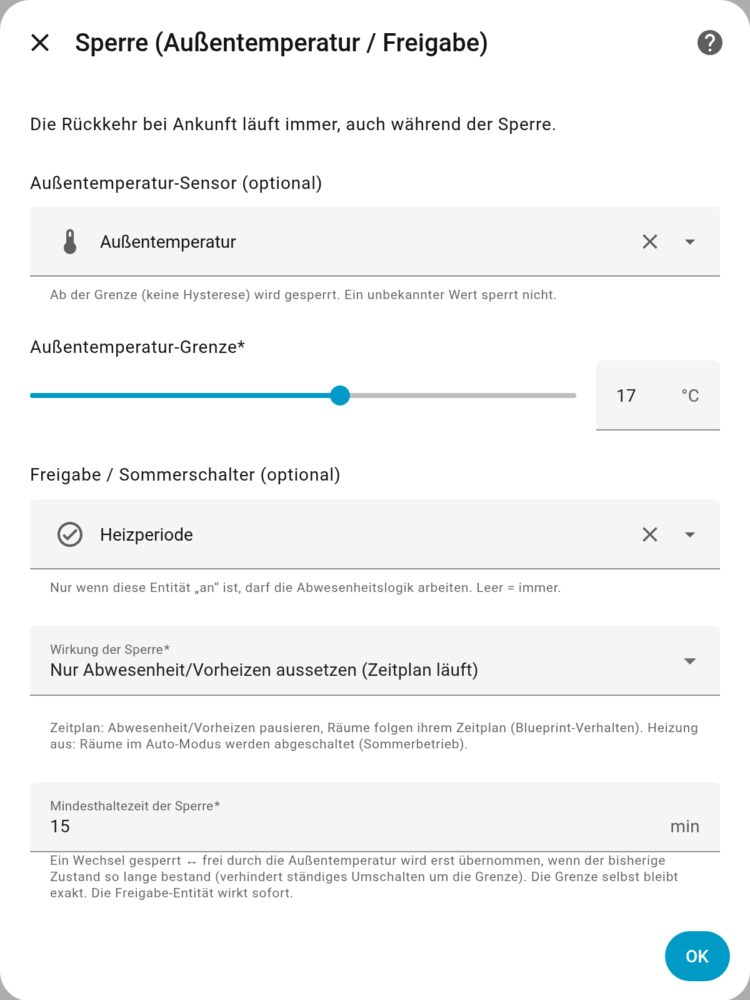

* **Außentemperatur-Sensor + Grenze** – ab der Grenze wird gesperrt (unbekannte Werte sperren nie).
* **Freigabe / Sommerschalter** – nur wenn diese Entität *an* ist, arbeitet die Abwesenheitslogik.
* **Wirkung der Sperre** – *Zeitplan*: nur Abwesenheit/Vorheizen aussetzen; *Heizung aus*: Räume
  im Auto-Modus schalten ab (Sommerbetrieb).
* **Mindesthaltezeit** – verhindert Flattern um die Grenze.

### Schritt 4 – Luft: Außenwerte

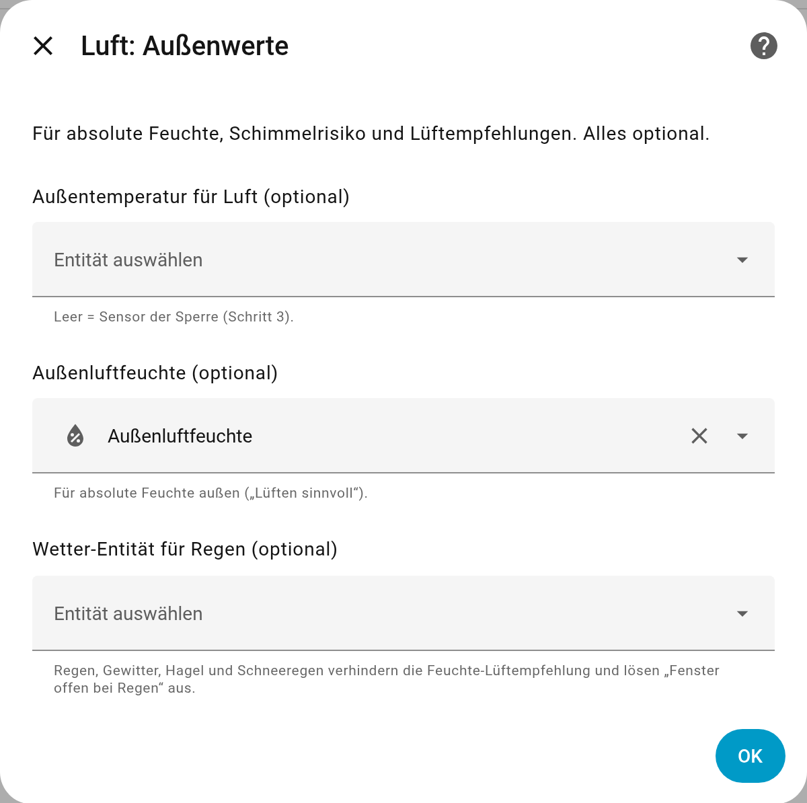

Außenluftfeuchte und Wetter-Entität (Regen) verbessern die Lüftempfehlung. Alles optional.

### Schritt 5 – Beratung: Benachrichtigungen

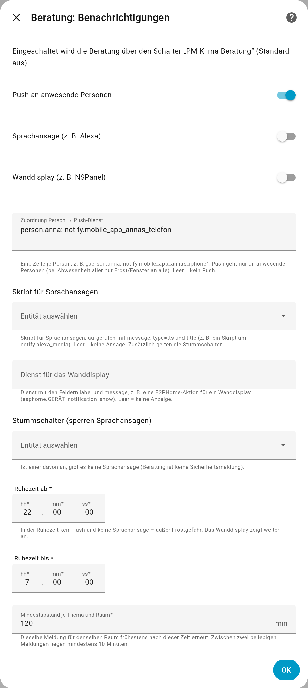

* **Push** an anwesende Personen: eine Zeile je Person, z. B.
  `person.anna: notify.mobile_app_annas_telefon`.
* **Sprachansage** (z. B. Alexa) und **Wanddisplay** (z. B. NSPanel) wirken nur mit eingetragenem
  Skript bzw. Dienst – es gibt keine Vorbelegung.
* **Stummschalter**, **Ruhezeit** und **Mindestabstand** drosseln die Meldungen.

Die Beratung selbst wird erst über den Schalter `switch.pm_klima_beratung` aktiviert (Standard aus).

---

## Teil 2: Räume

Auf der Integrationsseite **Raum hinzufügen**. Vier Schritte je Raum.

### Schritt 1 – Geräte

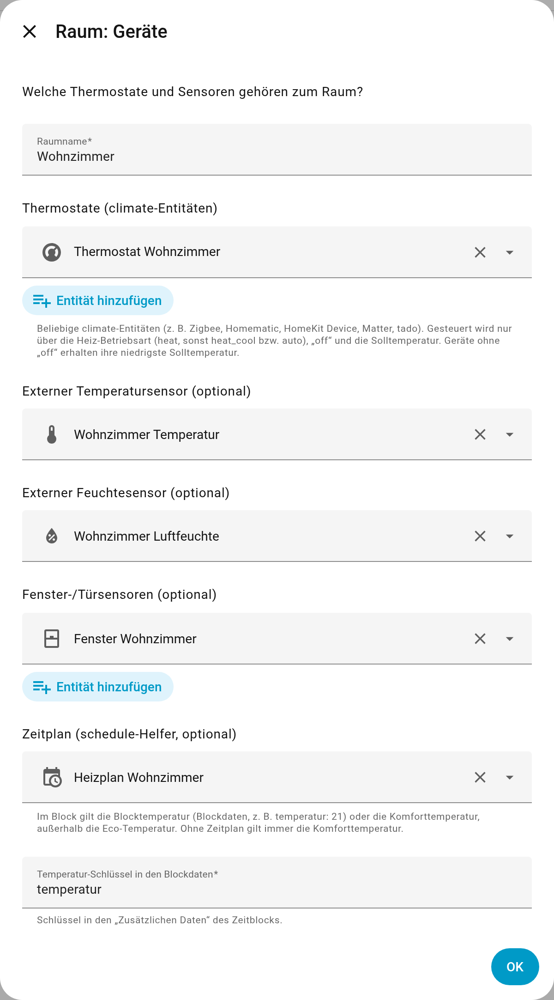

* **Raumname** – ergibt `climate.pm_<name>` (z. B. „Wohnzimmer“ → `climate.pm_wohnzimmer`).
* **Thermostate** – eine oder mehrere `climate`-Entitäten; jedes Thermostat nur in einem Raum.
* **Temperatur-/Feuchtesensor** – optional; sonst die Werte des Thermostats.
* **Fenstersensoren** – mehrere möglich; mindestens eines offen = Fenster offen.
* **Zeitplan** und **Temperatur-Schlüssel** der Blockdaten (Standard `temperatur`).

### Schritt 2 – Temperaturen

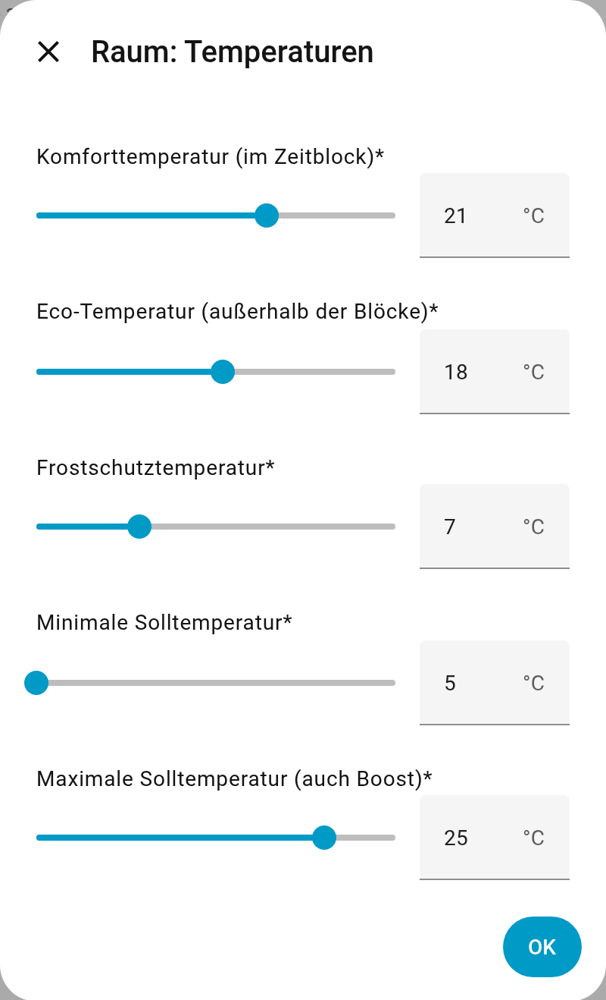

Komfort gilt im Zeitblock (ohne Blocktemperatur), Eco außerhalb. Max ist zugleich die
Boost-Temperatur.

### Schritt 3 – Verhalten

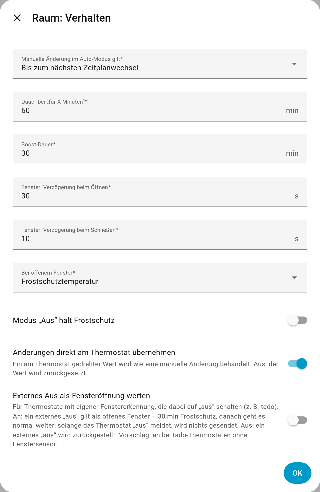

* **Manuelle Änderung im Auto-Modus gilt** – bis zum nächsten Zeitplanwechsel, für X Minuten
  oder dauerhaft.
* **Fenster** – Verzögerungen und Aktion (Frostschutz oder aus).
* **Modus „Aus“ hält Frostschutz** – sinnvoll bei Frostgefahr.
* **Änderungen direkt am Thermostat übernehmen** – gedrehte Werte werden zum Overlay.
* **Externes Aus als Fensteröffnung werten** – nur für Thermostate mit eigener Fenstererkennung,
  die dabei „aus“ melden (tado). Vorschlag: an bei tado ohne Fenstersensor.

### Schritt 4 – Luft (optional)

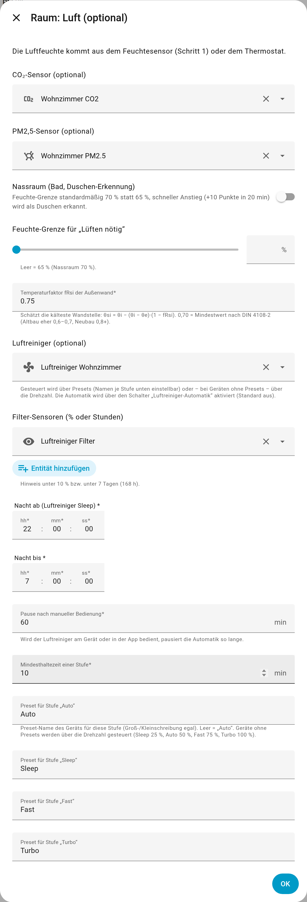

CO₂- und PM2,5-Sensor, Nassraum (Duschen-Erkennung), Feuchte-Grenze, Wandfaktor fRsi,
Luftreiniger mit Filter-Sensoren, Nachtfenster und den **Preset-Namen je Stufe**. Details:
[Luft & Beratung](luft-und-beratung.md).

Ein neuer Raum beginnt mit leerem Formular:

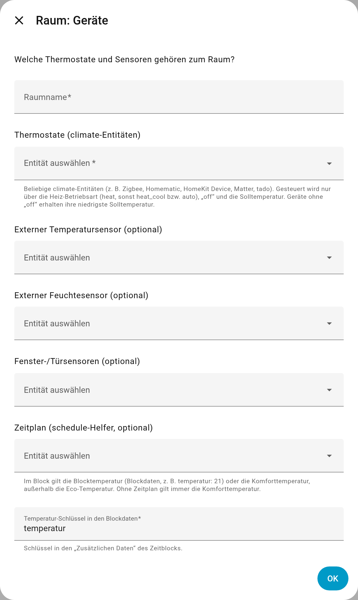

---

## Teil 3: Zeitplan mit Blocktemperaturen

Einstellungen → Geräte & Dienste → Helfer → **Helfer erstellen → Zeitplan**. Jeder Block ist
eine Komfortphase. Eine eigene Temperatur je Block tragen Sie im Block unter
*Erweiterte Einstellungen → Zusätzliche Daten* ein:

```yaml
temperatur: 21.5
```

Blöcke ohne Daten nutzen die Komforttemperatur, außerhalb der Blöcke gilt Eco. Als YAML
(`configuration.yaml`) sieht das so aus:

```yaml
schedule:
  heizplan_wohnzimmer:
    name: Heizplan Wohnzimmer
    monday:
      - from: "06:30:00"
        to: "08:30:00"
        data: {temperatur: 21}
      - from: "16:00:00"
        to: "22:30:00"
        data: {temperatur: 21.5}
    # tuesday … sunday analog
```

---

## Teil 4: Parallel laufende Hersteller-Logik abschalten

PM Klima übernimmt Zeitplan, Abwesenheit und Fensterlogik. Damit nichts doppelt regelt:

* Zeitpläne, Geofencing und „Away“-Modi in der Hersteller-App deaktivieren.
* Manuelle Änderungen in der Hersteller-App „dauerhaft“ gelten lassen
  (tado: Einstellungen → Räume → Manuelle Steuerung → „Bis du es aufhebst“).
* Eigene Automationen, die Thermostate direkt stellen, auf `climate.pm_<raum>` umstellen.

## Teil 5: Erster Test

1. Mit **einem Raum** beginnen.
2. `climate.pm_<raum>` öffnen: Attribut `anzeige` und Sensor `sensor.pm_<raum>_grund` zeigen,
   was gerade gilt (z. B. „Zeitplan · 21,5 °C bis 23:00“).
3. Am Raumthermostat eine Temperatur setzen → Overlay „Manuell · … bis …“.
4. Fenster öffnen → nach der Verzögerung „Fenster offen · Frostschutz“.
5. `pm_heizung.abhaengigkeiten` aufrufen und prüfen, ob alles gefunden wird.

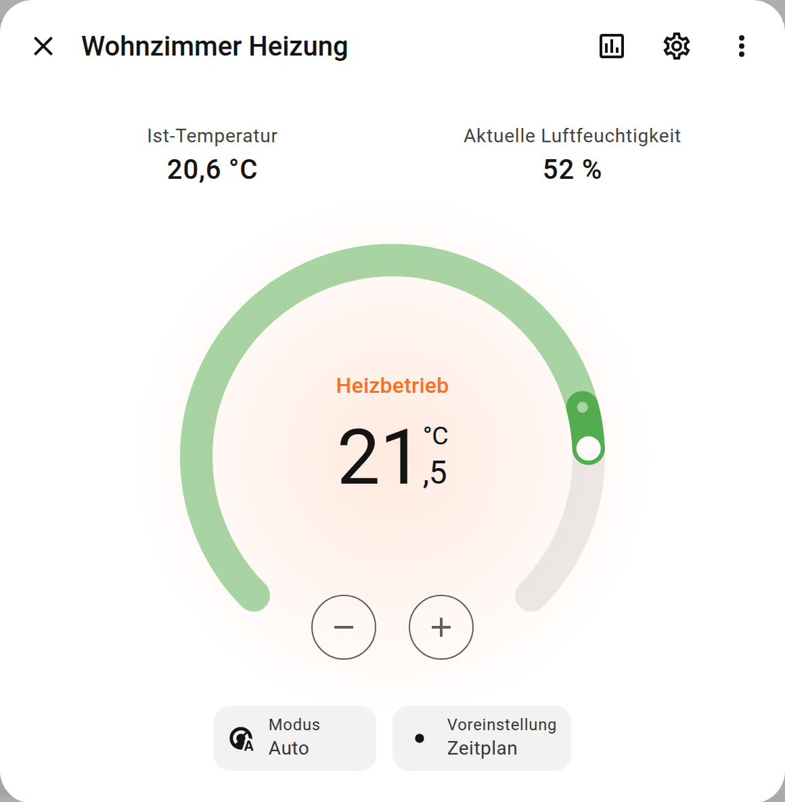

**Hauptschalter** `switch.pm_heizung_aktiv`: aus = PM Klima sendet nichts mehr (Notfall/Umstieg).
Wieder an = alle Räume werden abgeglichen.
