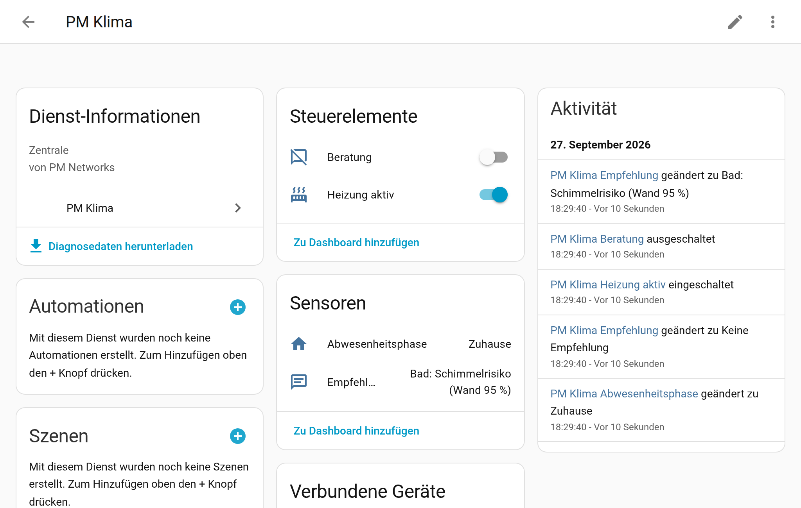

# Entitäten, Attribute & Dienste

[← Zurück zur Übersicht](../README.md)

## Entitäten

| Entität | Beschreibung |
|---|---|
| `climate.pm_<raum>` | Raumthermostat; Attribute `grund`, `anzeige`, `eingestellt`, `phase`, `naechster_wechsel`, `naechster_wechsel_grund`, `overlay_bis`, `boost_bis`, `zeitplan_temperatur`, `im_zeitblock`, `fenster_offen`, `ziel_backend`, `extern_aus_abgelehnt`, `thermostat_typ` |
| `sensor.pm_<raum>_grund` | Grund der aktuellen Solltemperatur (Enum) |
| `binary_sensor.pm_<raum>_fenster_offen` | mindestens ein Fenster offen (roh), Attribut `wirksam` |
| `sensor.pm_heizung_abwesenheitsphase` | zuhause/komfort/zwischen/halten/fern |
| `switch.pm_heizung_aktiv` | Hauptschalter Heizung |
| `sensor.pm_<raum>_luftqualitaet` | gut/mittel/schlecht; Attribute Messwerte, `gruende`, `lueften_noetig`, `lueften_sinnvoll`, `zu_trocken` |
| `sensor.pm_<raum>_schimmelrisiko` | rel. Feuchte an der Wand in %; Attribute `stufe`, `wandtemperatur`, `taupunkt`, `frsi` |
| `binary_sensor.pm_<raum>_lueften_empfohlen` | Lüften empfohlen; Attribute `noetig`, `sinnvoll`, `gruende`, `dauer_min`, abs. Feuchten |
| `sensor.pm_<raum>_lueftdauer` | empfohlene Stoßlüftdauer (min); Attribute `fenster_offen_seit`, `fenster_schliessen` |
| `switch.pm_<raum>_luftreiniger_automatik` | nur bei konfiguriertem Luftreiniger, Standard aus |
| `sensor.pm_klima_empfehlung` | wichtigste Empfehlung als Text; Attribut `liste`, `letzte_meldung` |
| `switch.pm_klima_beratung` | Beratung (Benachrichtigungen) an/aus, Standard aus |

## Dienste – Überblick

| Dienst | Felder |
|---|---|
| `pm_heizung.boost` | `dauer` (min, optional) |
| `pm_heizung.set_overlay` | `temperatur`, `dauer` (min; leer = Raumeinstellung, 0 = dauerhaft) |
| `pm_heizung.clear_overlay` | – (zurück zum Zeitplan, beendet auch Boost) |
| `pm_heizung.reevaluate` | – (alles neu berechnen und abgleichen) |
| `pm_heizung.abhaengigkeiten` | – (Antwort: Herkunft aller Entitäten, Cloud-/tado-Abhängigkeiten) |
| `pm_heizung.entitaet_ersetzen` | `alt`, `neu` (Antwort: geänderte Stellen) |
| `pm_heizung.beratung_testen` | `kanal` (push/alexa/panel), `thema` (optional); liefert Text und Ziele |

Außerdem funktionieren die Standarddienste `climate.set_temperature`, `climate.set_hvac_mode`,
`climate.set_preset_mode` (inkl. `zeitplan`/`manuell`), `climate.turn_on/off`.

---


## Beispiel: Attribute von `climate.pm_wohnzimmer`

```yaml
hvac_modes: ["auto", "heat", "off"]
min_temp: 5.0
max_temp: 25.0
target_temp_step: 0.5
preset_modes: ["none", "zeitplan", "manuell", "komfort", "eco", "abwesend", "frostschutz", "boost"]
current_temperature: 20.6
temperature: 21.5
current_humidity: 52.0
hvac_action: "heating"
preset_mode: "zeitplan"
grund: "zeitplan"
anzeige: "Zeitplan · 21,5 °C bis 23:00"
eingestellt: 21.5
phase: "zuhause"
zeitplan_temperatur: 21.5
im_zeitblock: true
naechster_wechsel: "2026-09-27T21:00:00+00:00"
naechster_wechsel_grund: "zeitplan"
overlay_bis: null
boost_bis: null
fenster_offen: false
ziel_backend: 21.5
extern_aus_abgelehnt: 0
fenster_extern_bis: null
extern_aus_pause: false
thermostat_typ: "generisch"
```



## Dienste – Beispiele

**Boost für 45 Minuten**

```yaml
action: pm_heizung.boost
target:
  entity_id: climate.pm_bad
data:
  dauer: 45
```

**Manuelle Temperatur für zwei Stunden, danach zurück zum Zeitplan**

```yaml
action: pm_heizung.set_overlay
target:
  entity_id: climate.pm_wohnzimmer
data:
  temperatur: 22.5
  dauer: 120
```

**Zurück zum Zeitplan**

```yaml
action: pm_heizung.clear_overlay
target:
  entity_id: climate.pm_wohnzimmer
```

**Testmeldung der Beratung (Antwort enthält Text und Ziele)**

```yaml
action: pm_heizung.beratung_testen
data:
  kanal: push
  thema: lueften_feuchte
response_variable: antwort
```

**Abhängigkeiten prüfen** und **Entität ersetzen**: siehe [Thermostate](thermostate.md).

## Automationen – Beispiele

**Boost, wenn morgens jemand das Bad betritt** (Präsenzmelder)

```yaml
alias: Bad – Boost bei Betreten am Morgen
triggers:
  - trigger: state
    entity_id: binary_sensor.bad_praesenz
    to: "on"
conditions:
  - condition: time
    after: "05:30:00"
    before: "08:00:00"
actions:
  - action: pm_heizung.boost
    target:
      entity_id: climate.pm_bad
    data:
      dauer: 20
mode: single
```

**Urlaub: alle Räume auf Frostschutz, bei Rückkehr zurück**

```yaml
alias: Urlaub – Heizung
triggers:
  - trigger: state
    entity_id: input_boolean.urlaub
actions:
  - if:
      - condition: state
        entity_id: input_boolean.urlaub
        state: "on"
    then:
      - action: climate.set_preset_mode
        target:
          entity_id: [climate.pm_wohnzimmer, climate.pm_kuche, climate.pm_schlafzimmer, climate.pm_bad]
        data:
          preset_mode: frostschutz
    else:
      - action: climate.set_preset_mode
        target:
          entity_id: [climate.pm_wohnzimmer, climate.pm_kuche, climate.pm_schlafzimmer, climate.pm_bad]
        data:
          preset_mode: zeitplan
mode: restart
```

**Benachrichtigung bei Schimmelrisiko** (ohne Modul Beratung)

```yaml
alias: Schimmelrisiko Bad melden
triggers:
  - trigger: state
    entity_id: sensor.pm_bad_schimmelrisiko
    attribute: stufe
    to: risiko
    for: "00:15:00"
actions:
  - action: notify.mobile_app_annas_telefon
    data:
      title: Schimmelrisiko
      message: "{{ state_attr('climate.pm_bad', 'friendly_name') }}: Wandfeuchte {{ states('sensor.pm_bad_schimmelrisiko') }} %."
mode: single
```
