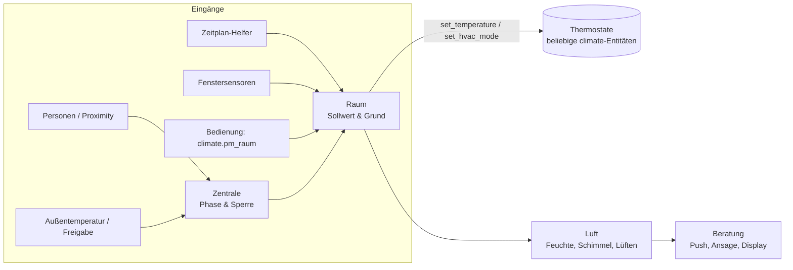

# Funktionsweise der Heizung

[← Zurück zur Übersicht](../README.md)

PM Klima rechnet je Raum einen **wirksamen Sollwert** aus und gibt ihn an die Thermostate weiter.
Die Thermostate regeln selbst; PM Klima entscheidet nur, *welche* Temperatur gerade gelten soll
und *warum*.

## Sprache

Oberfläche, Entitätsnamen und Zustände übersetzt Home Assistant (Deutsch, Englisch). Texte, die
PM Klima zur Laufzeit erzeugt – Attribut `anzeige`, Empfehlungen, Begründungen, Meldungen –,
folgen der Option **Sprache** (Zentrale, Schritt 1): *Automatisch* (Deutsch bei
Home-Assistant-Sprache `de`, sonst Englisch), *Deutsch* oder *Englisch*. Die Zustandswerte
(`zeitplan`, `manuell`, `fenster_extern` …) bleiben unabhängig davon gleich, damit
Automationen sprachunabhängig funktionieren.

## Was zeigt das Thermostat?

* **`temperature` (Soll)** = der **wirksame** Sollwert, also das, was das Thermostat bekommt
  (bei offenem Fenster z. B. 7 °C, bei Boost die Höchsttemperatur, bei „aus“ leer). Eine
  Eingabe wird **sofort** angezeigt (vor dem Senden), sofern nichts übersteuert.
* **`eingestellt`** = der Wert ohne Übersteuerung durch Fenster/Boost (Zeitplan, Overlay,
  Handwert, Abwesenheit). Eine Eingabe bei offenem Fenster geht nicht verloren, sie steht hier
  und gilt, sobald das Fenster zu ist.
* **`preset_mode`**: `zeitplan` (auto ohne Overlay), `manuell` (Overlay bzw. heat), bei
  Overlay über ein Preset dessen Name (`eco`, `komfort`, …), `boost`, `none` (aus).
  Preset **„zeitplan“ wählen = zurück zum Zeitplan** (Overlay/Boost beenden; aus heat/off
  zurück nach auto). „manuell“ im Auto-Modus hält den aktuellen Wert als Overlay fest.
* **`anzeige`** = deutscher Kurztext, z. B. „Zeitplan · 21 °C bis 22:30“, „Manuell · 22 °C bis
  22:00“, „Eco · 18 °C bis Mo 06:00“, „Fenster offen · Frostschutz (danach 22 °C)“,
  „Sperre · außen 17,4 °C“, „Abwesend · 18 °C“, „Vorheizen · 19,5 °C“, „Boost bis 20:15“,
  „Aus“, „Pausiert“.
* **`hvac_action`** optimistisch: eigener Sollwert „aus“ → sofort `off`; bis das Thermostat
  den Sollwert bestätigt (und bis zu 120 s danach, falls es noch Altes meldet) gilt
  Soll > Ist + 0,2 → `heating`, sonst `idle`; danach die Meldung des Thermostats.
* **`naechster_wechsel`** in heat: Boost-Ende oder leer; Grund steht in
  `naechster_wechsel_grund` (`zeitplan`, `overlay_ende`, `overlay_dauerhaft`,
  `manuell_dauerhaft`, `boost_ende`, `aus`, `kein_zeitplan`). `overlay_bis` gibt es nur in auto.
* **`extern_aus_abgelehnt`** zählt, wie oft das Thermostat von außen (am Gerät, in der
  Hersteller-App oder durch die Hersteller-Cloud) ausgeschaltet und zurückgestellt wurde.
* **`thermostat_typ`**: `generisch`, `tado_cloud` (tado-Integration über die Web-API) oder
  `tado_lokal` (tado über HomeKit Device bzw. Matter).

## Bedienlogik

* Temperatur setzen: auto → Overlay; heat → dauerhafter Handwert; **off → Wechsel auf heat mit
  diesem Wert**. Wird dabei ausdrücklich `hvac_mode: off` mitgegeben, bleibt der Raum
  aus und merkt sich den Wert (`eingestellt`) für das nächste Einschalten.
* Wechsel auto → heat übernimmt **nie** Frostschutz-, Fenster- oder Boostwerte, sondern das
  aktive manuelle Overlay, sonst den letzten Handwert, sonst den aktuellen Zeitplanwert bzw.
  Komfort.
* Wechsel auf heat oder off **beendet Overlay und Boost**.
* **Externes „aus“** vom Thermostat bzw. der Hersteller-Cloud – je Raum einstellbar über
  „Externes Aus als Fensteröffnung werten“ (Standard: **an bei tado-Thermostaten ohne
  Fenstersensor**, sonst aus – nur tado schaltet bei seiner Fenstererkennung auf „aus“):
  * **an** → gilt als Fenstererkennung des Thermostats: **30 min Frostschutz** (Grund
    `fenster_extern`, Anzeige „Fenster (Thermostat) · Frostschutz bis 14:35“), danach normal
    weiter. Solange das Thermostat „aus“ meldet, wird **nichts gesendet**; schaltet es selbst
    wieder ein, endet die Phase sofort. Eigene Bedienung beendet sie ebenfalls.
  * **aus** → wird **nicht übernommen**: Sollwert wird wiederhergestellt, Warnung höchstens
    alle 15 min, Zähler `extern_aus_abgelehnt`.
  * **Pingpong-Schutz** (schont Batterie und ggf. das Kontingent einer Hersteller-API): ab 3 Ablehnungen in
    30 min wird das Zurückstellen zurückgehalten – 5, 10, 20, 40, höchstens 60 min – bzw. bis
    zur nächsten eigenen Änderung. Auch ein „aus“ unmittelbar nach dem eigenen Senden zählt
    dafür mit. Zusätzlich erscheint unter Einstellungen → Reparaturen der Hinweis „Thermostat
    in <Raum> wird wiederholt ausgeschaltet“ (Geofencing/Zeitplan/Fenstererkennung in der
    Hersteller-App prüfen); er verschwindet nach 60 min ohne externes Aus von selbst.
    Attribut `extern_aus_pause`.
  Externe **Temperatur**änderungen werden weiterhin wie eingestellt als Overlay/Handwert
  übernommen. Ausschalten also über `climate.pm_<raum>`.

## Wie wird die Solltemperatur bestimmt? (Priorität von oben nach unten)

1. **Modus off** → Thermostat aus (optional Frostschutz)
2. **Fenster offen** (nach Verzögerung) → Frostschutz bzw. aus – gilt auch im Modus *heat*
3. **Boost** → Maximaltemperatur für X Minuten
4. **Modus heat** → manuelle Temperatur, dauerhaft
5. **Auto + manuelles Overlay** → Overlay-Temperatur
6. **Auto + Sperre mit Wirkung „Heizung aus“** → aus (Sommerbetrieb)
7. **Auto + Abwesenheit wirksam** → Phasentemperatur
8. **Auto** → Zeitplan: Blocktemperatur bzw. Komfort im Block, Eco außerhalb

Der Sensor `sensor.pm_<raum>_grund` bzw. das Attribut `grund` nennt die wirksame Stufe:
`zeitplan`, `abwesenheit`, `vorheizen`, `fenster`, `fenster_extern`, `sperre`, `manuell`, `boost`,
`aus`, `pausiert`.

## Wie wird die Solltemperatur bestimmt? (Priorität von oben nach unten)

1. **Modus off** → Thermostat aus (optional Frostschutz)
2. **Fenster offen** (nach Verzögerung) → Frostschutz bzw. aus – gilt auch im Modus *heat*
3. **Boost** → Maximaltemperatur für X Minuten
4. **Modus heat** → manuelle Temperatur, dauerhaft
5. **Auto + manuelles Overlay** → Overlay-Temperatur
6. **Auto + Sperre mit Wirkung „Heizung aus“** → aus (Sommerbetrieb)
7. **Auto + Abwesenheit wirksam** → Phasentemperatur
8. **Auto** → Zeitplan: Blocktemperatur bzw. Komfort im Block, Eco außerhalb

Der Sensor `sensor.pm_<raum>_grund` bzw. das Attribut `grund` nennt die wirksame Stufe:
`zeitplan`, `abwesenheit`, `vorheizen`, `fenster`, `fenster_extern`, `sperre`, `manuell`, `boost`,
`aus`, `pausiert`.

## Abwesenheit & Vorheizen

Halten = Komfort − Absenkung, Fern = zusätzlich − Fern-Absenkung, nie unter der
Mindesttemperatur und nie über der aktuellen Zeitplantemperatur; Rückkehr bei Ankunft läuft
immer; Sperre friert nicht ein; Verlassen-Verzögerung nur beim Übergang jemand → niemand
(neustartsicher); Mindesthaltezeit der Sperre. Ohne Proximity-Sensoren wird bei Abwesenheit
nur abgesenkt (Phase „halten“).

---

## Abwesenheitsphasen

| Phase | Bedingung (niemand zuhause, nach der Verlassen-Verzögerung) | Solltemperatur |
|---|---|---|
| `zuhause` | jemand ist zuhause | Zeitplan |
| `komfort` | jemand innerhalb des Nahradius (bei „Annäherung erforderlich“: Richtung *towards*) | Zeitplan – Vorheizen |
| `zwischen` | jemand innerhalb des Mittelradius | Mitte zwischen Halten und Komfort – Vorheizen |
| `halten` | jemand innerhalb des Fernradius bzw. ohne Proximity-Sensoren | Komfort − Absenkung |
| `fern` | alle außerhalb des Fernradius | Komfort − Absenkung − Fern-Absenkung |

Eine erreichte Vorheizstufe bleibt, solange niemand *away_from* meldet und die Person im Radius
bleibt. Beispiel mit Komfort 21 °C, Absenkung 3 K, Fern-Absenkung 2 K, Mindesttemperatur 16 °C:
fern 16 °C · halten 18 °C · zwischen 19,5 °C · komfort 21 °C.

Nie unter der Mindesttemperatur und nie über der aktuellen Zeitplantemperatur. Die Rückkehr bei
Ankunft läuft immer, auch während der Sperre.

## Bekannte Grenzen

* Kein eigenes Regelverhalten (keine PID-/Offset-Regelung): Die Thermostate regeln selbst, PM
  Klima gibt nur Sollwert und Modus vor. Ein externer Temperatursensor dient der Anzeige und der
  abgeleiteten `hvac_action`. Für Thermostate mit stark abweichender Eigenmessung ist eine
  Kalibrierung (z. B. Better Thermostat) davor sinnvoll.
* Kein Kühlen; kein Lernen der Aufheizzeit – Vorheizen erfolgt über Proximity.
* Änderungen direkt am Thermostat: Temperaturen werden übernommen (Option), ein geräteeigener
  Zeitplan (`auto`) wird zurückgestellt, „aus“ je nach Raumoption als Fensteröffnung gewertet
  oder (gedrosselt) zurückgestellt.
* Overlay „bis zum nächsten Zeitplanwechsel“ ohne (verfügbaren) Zeitplan gilt 60 min.
* Ein Thermostat kann nur einem Raum zugeordnet werden.
* Luft: Die Wandtemperatur ist eine Schätzung über fRsi (keine Messung). CO₂/Feinstaub sind nur
  so gut wie die Sensoren; Regen wird über den Zustand der Wetter-Entität erkannt.
* Beratung: „anwesend“ je Person = Personen-Zustand `home`; die Zeitbedingungen werden minütlich
  geprüft.
* Getestet mit pytest gegen Home Assistant 2026.2.3 (letzte Version für Python 3.13).
  `via_device_id` (ab 2026.8) wird automatisch genutzt, ältere Versionen erhalten `via_device`.

---
