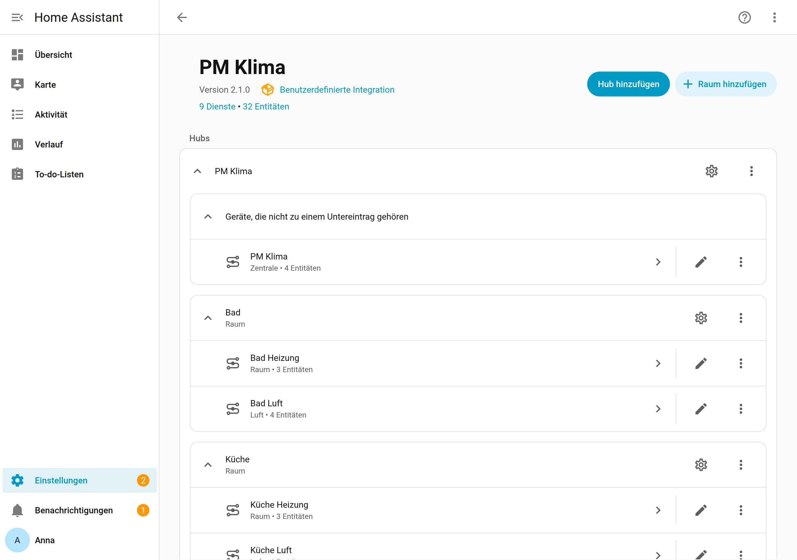

# Installation

[← Zurück zur Übersicht](../README.md)

## Voraussetzungen

| Punkt | Anforderung |
|---|---|
| Home Assistant | 2026.2 oder neuer (getestet mit 2026.2.3, API-Abgleich mit 2026.9.3) |
| Thermostate | beliebige `climate`-Entitäten mit Solltemperatur – siehe [Thermostate](thermostate.md) |
| Personen | mindestens eine `person`-Entität (für Abwesenheit und Vorheizen) |
| optional | Proximity-Integration, Fenster-/Türsensoren, Zeitplan-Helfer, Feuchte-/CO₂-/PM2,5-Sensoren, Luftreiniger (`fan`), Wetter-Entität |

PM Klima benötigt keine Python-Pakete und keine Cloud; alles läuft lokal (`iot_class: calculated`).

## Variante A: HACS (empfohlen)

[](https://my.home-assistant.io/redirect/hacs_repository/?owner=D0GC&repository=HA-PM-Networks-Klima&category=integration)

Ein Klick öffnet HACS in Ihrer eigenen Home-Assistant-Instanz direkt mit diesem Repository
(My Home Assistant). Dort **Herunterladen** wählen und Home Assistant neu starten.

> **Hinweis:** Bis zur Aufnahme in die HACS-Standardliste fragt HACS ggf. nach, ob das Repository
> als benutzerdefiniertes Repository hinzugefügt werden soll – das geschieht über denselben Dialog.

Ohne den Button:

1. HACS öffnen → oben rechts **⋮ → Benutzerdefinierte Repositories**.
2. Repository `https://github.com/D0GC/HA-PM-Networks-Klima`, Typ **Integration**, hinzufügen.
3. In HACS nach **PM Klima** suchen → **Herunterladen**.
4. Home Assistant **neu starten** (Einstellungen → System → ⏻ → Home Assistant neu starten).

Updates erscheinen danach wie gewohnt in HACS.

## Variante B: manuell

1. Das Repository als ZIP herunterladen (Code → Download ZIP) oder ein Release wählen.
2. Den Ordner `custom_components/pm_heizung/` nach `/config/custom_components/pm_heizung/` kopieren
   (Add-on *File editor*, *Studio Code Server*, Samba oder SSH). Ergebnis:
   ```
   /config/custom_components/pm_heizung/__init__.py
   /config/custom_components/pm_heizung/manifest.json
   /config/custom_components/pm_heizung/translations/de.json
   …
   ```
3. Home Assistant **neu starten** – neue Custom-Integrationen werden nur beim Start erkannt.

## Integration hinzufügen

Einstellungen → Geräte & Dienste → **Integration hinzufügen** → „PM Klima“. Es folgen fünf
Schritte für die Zentrale, danach werden die Räume angelegt – siehe [Einrichtung](einrichtung.md).



Auf der Integrationsseite erscheinen die **Zentrale** (Zahnrad = Konfigurieren) und je Raum ein
Untereintrag mit den Geräten „<Raum> Heizung“ und „<Raum> Luft“ (Zahnrad = Raum bearbeiten).

## Update

* HACS: Update installieren, neu starten.
* Manuell: Ordner `custom_components/pm_heizung/` **vollständig ersetzen** (alte Dateien vorher
  löschen), neu starten.

Die Konfiguration wird beim Start automatisch migriert (aktuelles Schema 1.4). Entitäts-IDs,
Räume, Overlays und Schalterzustände bleiben erhalten. Vor größeren Updates empfiehlt sich eine
Sicherung (Einstellungen → System → Sicherungen).

## Deinstallation

1. Einstellungen → Geräte & Dienste → PM Klima → ⋮ → **Löschen**.
2. In HACS entfernen bzw. den Ordner `custom_components/pm_heizung/` löschen, neu starten.
3. Hersteller-Zeitpläne und -Geofencing ggf. wieder aktivieren.
