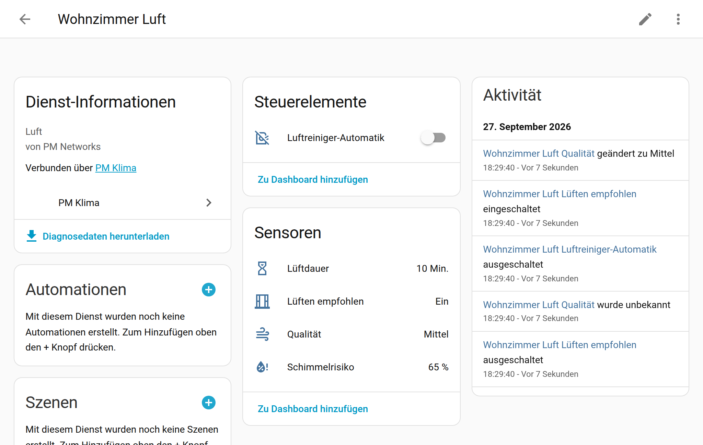

# Luft & Beratung

[← Zurück zur Übersicht](../README.md)

Beide Module sind **optional** und fehlerisoliert: Sie lesen die Heizung nur mit und können sie
nicht beeinträchtigen.



## Modul Luft

Je Raum (alle Felder optional, Raum bearbeiten → Schritt „Luft“):

* Luftfeuchte: Feuchtesensor aus Schritt 1, sonst die Feuchte des Thermostats
* CO₂-Sensor, PM2,5-Sensor, Nassraum (Bad), Feuchte-Grenze (Standard 65 %, Nassraum 70 %),
  fRsi (Standard 0,75)
* Luftreiniger (`fan`), Filter-Sensoren, Nachtfenster, Pause nach manueller Bedienung
  (60 min), Mindesthaltezeit (10 min), Preset-Name je Stufe

Zentral (Konfigurieren → Schritt „Luft“): Außentemperatur (leer = Sensor der Sperre),
Außenluftfeuchte, Wetter-Entität (Regen).

**Berechnungen**

| Größe | Formel / Regel |
|---|---|
| Sättigungsdampfdruck | Magnus über Wasser: E(T) = 6,112 hPa · exp(17,62·T / (243,12 + T)) |
| absolute Feuchte | ρ = 216,7 · (φ·E(T)) / (273,15 + T) g/m³ (20 °C/50 % ≈ 8,6 g/m³) |
| Taupunkt | Magnus-Umkehr (20 °C/50 % ≈ 9,3 °C) |
| Wandoberfläche | θsi = θi − (θi − θe)·(1 − fRsi) |
| Schimmelrisiko | rel. Feuchte an der Wand φsi = φ·E(θi)/E(θsi); > 70 % Warnung, > 80 % Risiko |
| Lüften sinnvoll | abs. Feuchte außen < innen − 1 g/m³ und kein Regen |
| Lüften nötig | Feuchte > Grenze, Wandfeuchte > 80 % (Risiko) oder CO₂ ≥ 1000 ppm – die Stufe „Warnung“ (70–80 %) allein ist nur Anzeige |
| Lüften empfohlen | nötig **und** (CO₂-Grund **oder** sinnvoll) **und** Fenster zu |
| Stoßlüftdauer | < 0 °C 5 min, 0–10 °C 10 min, 10–15 °C 15 min, ≥ 15 °C 25 min |
| Fenster-zu-Erinnerung | offen länger als Lüftdauer + 5 min, nur bei Außentemperatur < 15 °C |
| Luftqualität | schlecht: CO₂ > 1400, Feuchte > 70 % oder < 30 %, PM2,5 > 35, Wand > 80 % · mittel: CO₂ > 1000, Feuchte > Grenze oder < 35 %, PM2,5 > 12, Wand > 70 % · sonst gut |
| Duschen (Nassraum) | Anstieg ≥ 10 Prozentpunkte in 20 min → Texte „nach dem Duschen“ (60 min) |

Hinweis: Standard fRsi 0,75 (DIN 4108-2 fordert mindestens 0,70). Beispiel 20 °C/50 % innen,
−5 °C außen: Wand 13,8 °C, ≈ 74 % → „Warnung“ (nur Anzeige, keine Lüftmeldung). Bei gut
gedämmten Wänden fRsi auf 0,8 bis 0,9 erhöhen, bei Altbau mit Wärmebrücken eher 0,70.

**Luftreiniger-Automatik** (`switch.pm_<raum>_luftreiniger_automatik`, Standard **aus**,
neustartsicher). Vier Stufen – Auto, Sleep, Fast, Turbo. Die Standardnamen entsprechen den
Presets von Philips Air+; je Raum lässt sich einstellen, welches Preset des Geräts zu welcher
Stufe gehört (z. B. Xiaomi: Sleep = „Silent“, Fast = „Favorite“). Geräte **ohne Presets**
(z. B. IKEA, viele Zigbee-Lüfter) werden über die Drehzahl gesteuert: Sleep 25 %, Auto 50 %,
Fast 75 %, Turbo 100 % (Rückmeldungen mit ±12 Prozentpunkten gelten als erreicht).

1. Fenster offen → aus (sofort, 30 s Mindestabstand)
2. PM2,5 > 35 → Turbo (nachts Fast), Hysterese: zurück erst < 30
3. PM2,5 > 12 → Auto, Hysterese: zurück erst < 10
4. Nachtfenster → Sleep
5. niemand zuhause → Auto
6. sonst Auto

Mindesthaltezeit je Stufe (10 min). Presets werden ohne Rücksicht auf Groß-/Kleinschreibung
verglichen und in der Schreibweise des Geräts gesendet; fehlt ein Preset, gilt Turbo → Fast →
Auto als Rückfall. „An ohne Preset“ gilt nicht als Auto.
Eigene Befehle werden über den Kontext und ein Erwartungsfenster erkannt (2 min jede
Rückmeldung, bis 5 min ein Wechsel genau auf das eigene Ziel), manuelle Bedienung am Gerät/in
der App pausiert die Automatik (60 min, neustartsicher gespeichert). Attribute: `ziel`,
`begruendung`, `pausiert_bis`, `letzter_befehl`.

**Filterhinweise** bei < 10 % bzw. < 7 Tagen (Sensoren mit Einheit `%` oder `h`).

---

## Modul Beratung

Globaler Schalter **`switch.pm_klima_beratung`** (Standard **aus**; neustartsicher). Die
Empfehlungsliste im Sensor `sensor.pm_klima_empfehlung` läuft unabhängig davon immer.

Themen (Priorität): Frostgefahr (innen < 12 °C) · Heizen bei offenem Fenster · Schimmelrisiko ·
Fenster schließen (Zeit) · Fenster offen bei Regen · Lüften CO₂ · Lüften Feuchte (Bad nach dem
Duschen eigener Textsatz) · Feinstaub (nur ohne aktive Luftreiniger-Automatik) · zu trocken ·
Filterwartung. „Schimmelwarnung“ (70–80 %) erscheint nur in der Liste.

Kanäle (Konfigurieren → Schritt „Beratung“). Es gibt **keine Vorbelegung**: Ein Kanal wirkt
erst, wenn sein Ziel eingetragen ist.

| Kanal | Aufruf | Standard | Bedingung |
|---|---|---|---|
| Push | `notify.<dienst>` mit `title` (mit Emoji) und `message` | an | nur an **anwesende** Personen laut Zuordnung |
| Sprachansage | Skript mit `message`, `type: tts`, `title` (z. B. um `notify.alexa_media`) | aus | keine Stummschalter an |
| Wanddisplay | Dienst mit `label`, `message` (z. B. ESPHome-Aktion eines NSPanels) | aus | – |
| Dashboard | `sensor.pm_klima_empfehlung` | immer | – |

Push-Zuordnung, eine Zeile je Person:

```
person.anna: notify.mobile_app_annas_iphone
person.ben: notify.mobile_app_pixel_ben
```

Regeln:

* Eine Empfehlung muss **5 min** bestehen, bevor gemeldet wird.
* Je Thema und Raum höchstens alle **120 min** (einstellbar); zwischen zwei beliebigen
  Meldungen mindestens **10 min** (Frost ausgenommen); je Durchlauf nur die wichtigste.
* **Ruhezeit** (Standard 22:00–07:00): kein Push und keine Ansage – außer Frostgefahr; das
  Wanddisplay zeigt weiter an.
* **Stummschalter** (beliebige `input_boolean`/`switch`/`binary_sensor`): an → keine Ansage.
* **Niemand zuhause**: keine Meldungen, außer Frostgefahr und Fenster offen/Heizen bei offenem
  Fenster → Push an **alle** zugeordneten Personen.
* Drosselzustände und Schalter werden gespeichert (neustartsicher).

Texte im „Jarvis“-Register (höflich-distanziert, Empfehlungen statt Anweisungen, keine
Ausrufezeichen, keine Emoji im Fließtext, höchstens ein trockener Nachsatz), je Meldungsart
und Sprache **10 Varianten**, z. B. „Die Luftfeuchte im Badezimmer liegt bei 74 Prozent. Ich
empfehle, zehn Minuten stoßzulüften.“ bzw. „The humidity in the Bathroom is 74 percent. I
recommend airing the room for ten minutes.“

Test: `pm_heizung.beratung_testen` mit `kanal` (push/alexa/panel) und optional `thema` –
sendet sofort (ohne Drosselung, Ruhezeit, Stummschalter und Anwesenheitsprüfung) und gibt Text
und Ziele als Antwort zurück.

---
