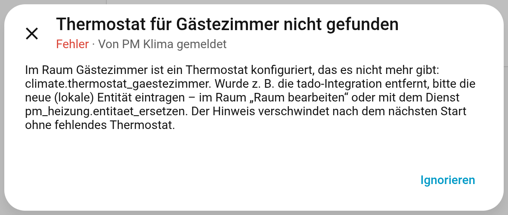

# Thermostate & Anbindung

[← Zurück zur Übersicht](../README.md)

## Grundprinzip

PM Klima enthält **keine Hersteller-Schnittstelle**. Es steuert vorhandene `climate`-Entitäten
über die Standarddienste von Home Assistant:

* `climate.set_temperature` mit Solltemperatur und Heiz-Betriebsart
* `climate.set_hvac_mode` für „aus“ – und als Nachzug, falls ein Gerät die Betriebsart in
  `set_temperature` nicht auswertet (z. B. `generic_thermostat`)

Welche Integration dahinter steckt – Zigbee, Homematic, HomeKit, Matter, tado, ein
`generic_thermostat` mit Schaltsteckdose –, spielt keine Rolle.

## Wie PM Klima ein Gerät anspricht

| Gerät meldet (`hvac_modes`) | Heizen | Aus |
|---|---|---|
| `heat`, `off` (Normalfall) | Sollwert im Modus `heat` | `off` |
| `heat_cool`, `off` (kein `heat`) | Sollwert im Modus `heat_cool` | `off` |
| nur `auto` | Sollwert im Modus `auto` | niedrigste Solltemperatur |
| `heat` ohne `off` | Sollwert im Modus `heat` | niedrigste Solltemperatur (`min_temp`) |

Außerdem beachtet PM Klima `target_temp_step` (Rundung), `min_temp` und `max_temp`, sendet nur
bei Abweichung, entprellt (5 s), hält 10 s Mindestabstand, kontrolliert nach 30 s (höchstens drei
Versuche) und zieht nach `unavailable` nach. Bei Fehlern wartet es exponentiell (1–15 min).

## Erfahrungswerte je Integration

| Integration | Hinweise |
|---|---|
| **Zigbee (ZHA / Zigbee2MQTT)** | Heizkörperthermostate melden meist `heat`/`off`. Einige Tuya-Geräte kennen kein `off` → Frostschutz-Sollwert. Eigene Zeitpläne am Gerät deaktivieren. |
| **Homematic IP** | `auto` = Gerätezeitplan, `heat` = manuell. PM Klima schaltet auf `heat`. Zeitprofile am Gerät nicht parallel nutzen. |
| **FRITZ!DECT** | `heat`/`off`; Absenkzeiten in der FRITZ!Box deaktivieren. |
| **Netatmo** | `auto` = Netatmo-Zeitplan, `heat` = manuell. |
| **HomeKit Device / Matter** | lokal, ohne Cloud; tado V3+ über HomeKit und tado X über Matter werden als `tado_lokal` erkannt. |
| **tado (Cloud)** | funktioniert, belastet aber das API-Kontingent; ein einzelner Aufruf je Änderung. Umstieg auf lokal: [Anleitung](umstieg-tado-lokal.md). |
| **generic_thermostat** | wertet die Betriebsart in `set_temperature` nicht aus – PM Klima schickt `set_hvac_mode` nach. |

Die Tabelle beruht auf dem Verhalten der Home-Assistant-Integrationen; Erfahrungsberichte mit
weiteren Geräten sind als [Issue](https://github.com/D0GC/HA-PM-Networks-Klima/issues)
willkommen.

## Gerätetyp und „Externes Aus“

`climate.pm_<raum>` zeigt im Attribut `thermostat_typ`, wie die Thermostate angebunden sind:
`generisch`, `tado_cloud` oder `tado_lokal`. tado schaltet bei seiner eigenen
Fenster-offen-Erkennung das Thermostat auf „aus“. Deshalb schlägt PM Klima nur bei tado ohne
Fenstersensor vor, ein externes „aus“ als Fensteröffnung zu werten (30 min Frostschutz, ohne
Zurückstellen). Bei allen anderen Geräten gilt „aus“ am Gerät als Bedienfehler und wird
zurückgestellt – mit Pingpong-Schutz, falls es sich wiederholt.

## Thermostat wechseln, Cloud-Abhängigkeiten finden

Zeitpläne, Einstellungen und Zustände hängen am **Raum**, nicht am Thermostat. Ein Wechsel der
Anbindung ist deshalb nur ein Austausch der Entität.

**1. Abhängigkeiten prüfen** – Entwicklerwerkzeuge → Aktionen:

```yaml
action: pm_heizung.abhaengigkeiten
```

Antwort (gekürzt):

```json
{
  "raeume": {
    "Wohnzimmer": {
      "climate.thermostat_wohnzimmer": {
        "domain": "climate",
        "integration": "generic_thermostat",
        "iot_class": "local_polling",
        "cloud": false,
        "vorhanden": true,
        "typ": "generisch"
      },
      "sensor.wohnzimmer_temperatur": {
        "domain": "sensor",
        "integration": "template",
        "iot_class": "local_push",
        "cloud": false,
        "vorhanden": true,
        "typ": null
      }
    }
  },
  "cloud": [],
  "tado_cloud": [],
  "tado_cloud_thermostate": [],
  "fehlend": [
    "climate.thermostat_gaestezimmer"
  ],
  "tado_integration_entbehrlich": true
}
```

`cloud` listet alle Entitäten aus Cloud-Integrationen, `tado_cloud` alle aus der tado-Integration;
`tado_integration_entbehrlich: true` heißt, dass PM Klima die tado-Integration nicht mehr braucht.

**2. Entität ersetzen** – in allen Räumen und der Zentrale auf einmal:

```yaml
action: pm_heizung.entitaet_ersetzen
data:
  alt: climate.wohnzimmer          # darf bereits gelöscht sein
  neu: climate.wohnzimmer_homekit  # gleiche Domain, muss existieren
```

Das funktioniert auch für Temperatur- und Feuchtesensoren. Die Integration lädt danach neu.

**Alternative:** alte Integration entfernen und die neuen Entitäten auf die alten IDs
umbenennen – dann bleiben auch Automationen und Dashboards unverändert.

**3. Kontrolle** – fehlt ein konfiguriertes Thermostat, meldet PM Klima das unter
Einstellungen → Reparaturen:


